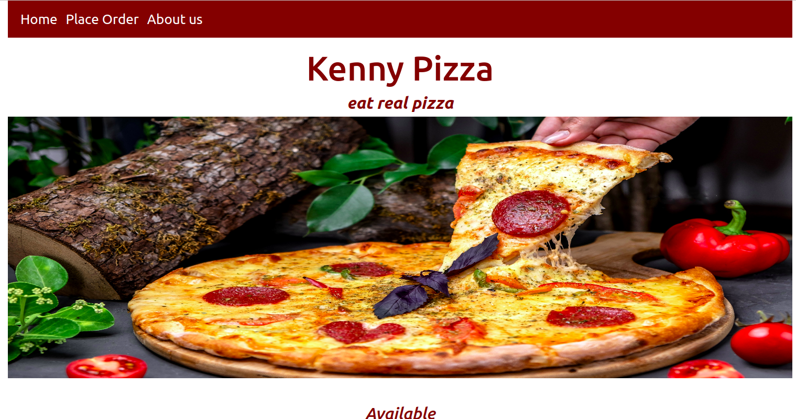

# [KENNY PIZZA](https://kiptoo-097.github.io/Kenny-pizza/)
# Kenny Pizza
Kenny pizza is a website that shows available pizza and allows one to choose and order pizza of your own choice. It also enables the customer to choose whether the pizza is to be delivered or to be picked with prices included. 

## Mobile support
This web page is compatible with devices of all sizes and all OS's, and consistent improvements are being made.

## [Usage]( https://kiptoo-097.github.io/Kenny-pizza/) 

### Development
Want to contribute? Great!

To fix a bug or enhance an existing module, follow these steps:

- Fork the repo
- Create a new branch (`git checkout -b improve-feature`)
- Make the appropriate changes in the files
- Add changes to reflect the changes made
- Commit your changes (`git commit -am 'Improve feature'`)
- Push to the branch (`git push origin improve-feature`)
- Create a Pull Request 

### Bug / Feature Request

If you find a bug (the website couldn't handle the query and / or gave undesired results), kindly open an issue [here]( https://kiptoo-097.github.io/Kenny-pizza/) by including your search query and the expected results.

## Built with 

HTML
CSS
Javascript
jQuery

## [License]( https://kiptoo-097.github.io/Kenny-pizza/LICENSE.md)

